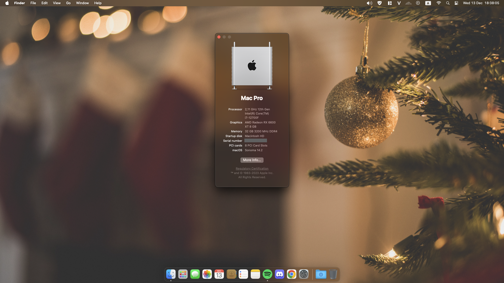
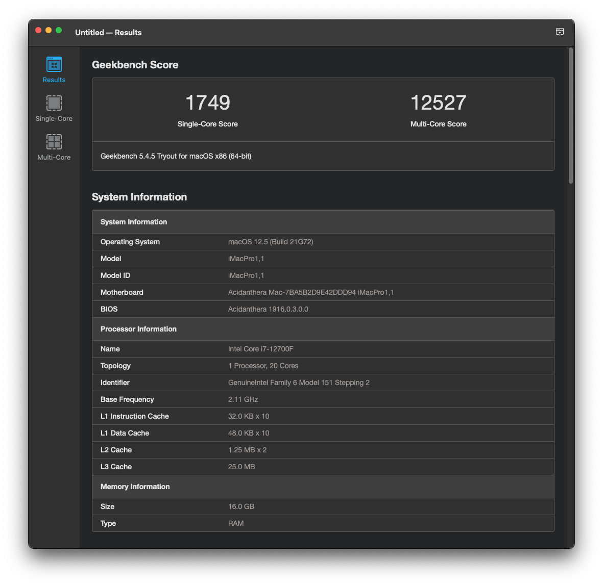
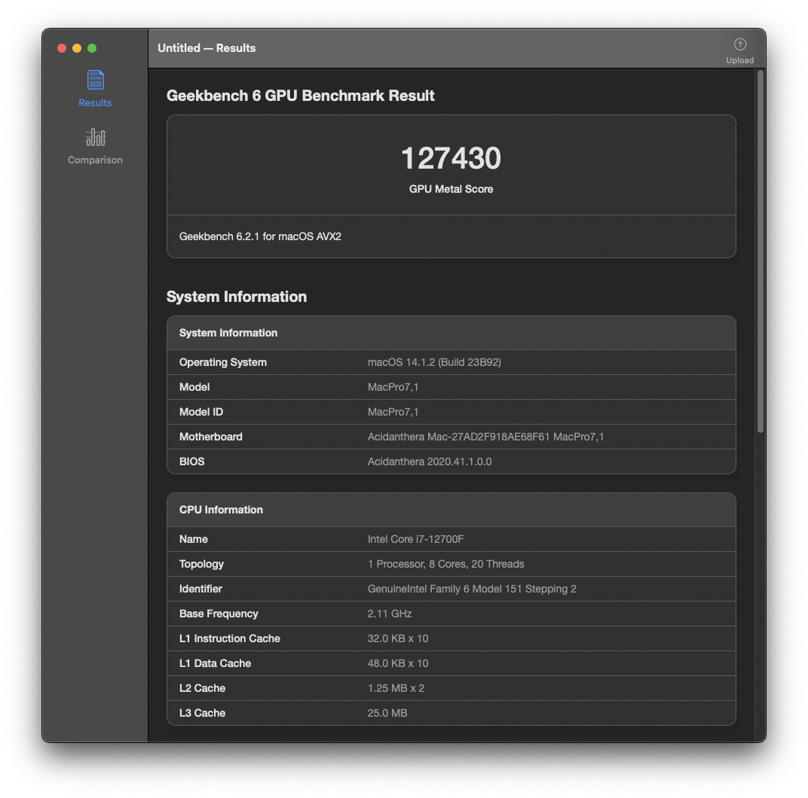
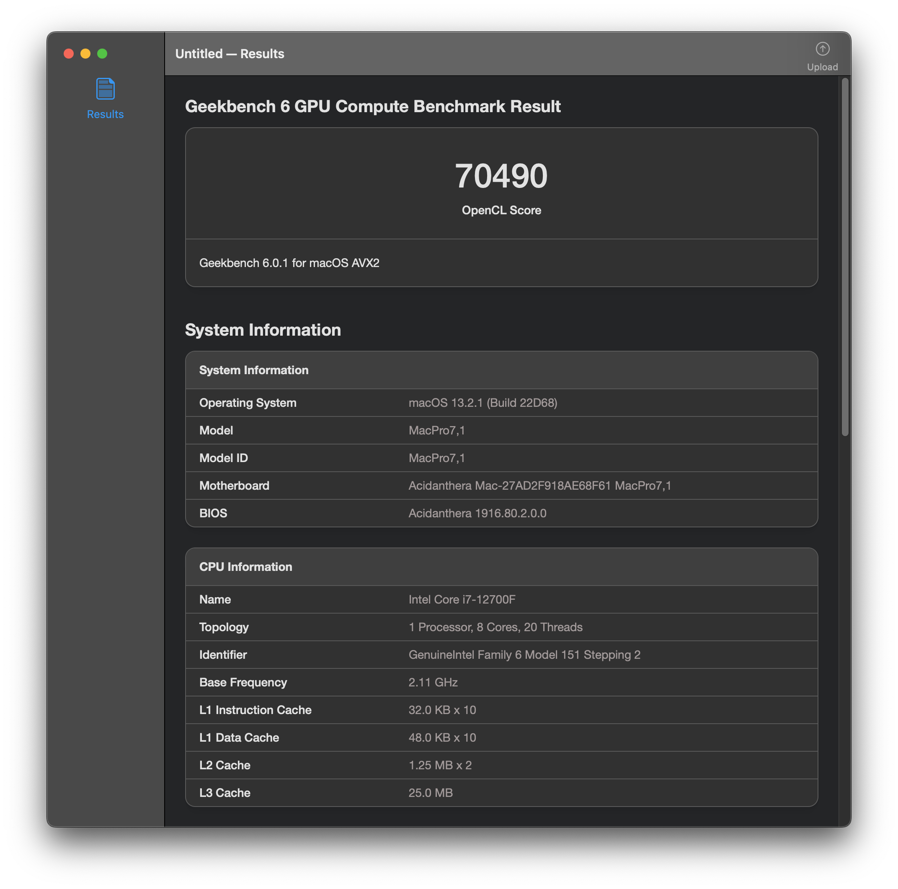
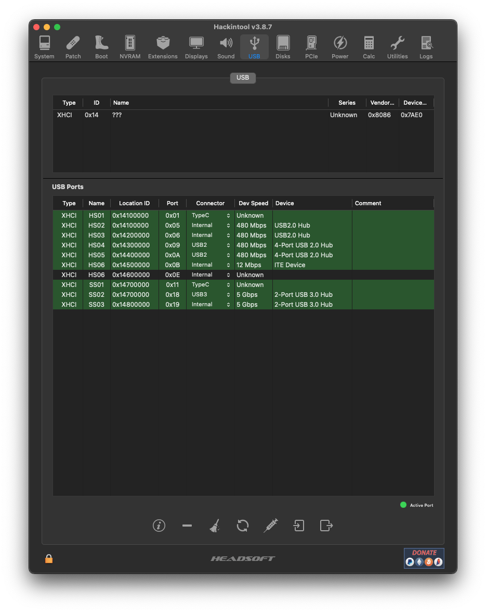
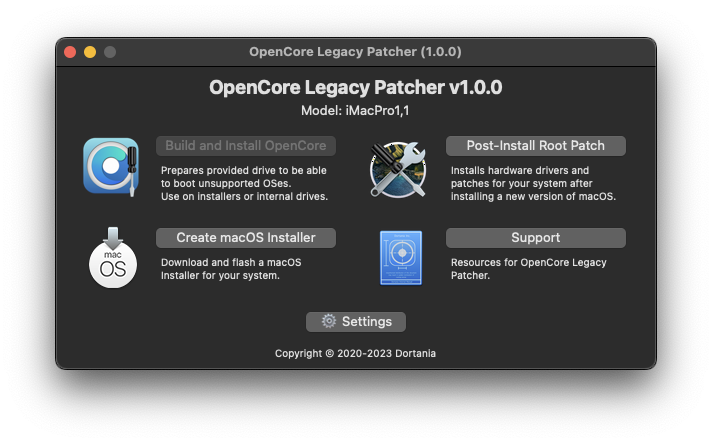

# Gigabyte Aorus Pro B660M Hackintosh

## System Overview

| Type | Item |
| ---- | ---- |
| Motherboard | B660M Gigabyte Aorus Pro DDR4 |
| CPU | Intel Core i7-12700F @ 2.10 GHz, 25M Cache, up to 4.90 GHz|
| RAM | 4 x Corsair Vengeance LPX 8GB 3200MHz DDR4 CMK16GX4M2E3200C |
| GPU | Sapphire Nitro+ RX 6600 XT 8GB |
| SSD1 | Western Digital SN850 500GB NVMe Gen4x4 Solid State Drive |
| SSD2 | Lexar 256GB SATA Solid State Drive |
| SSD3 | KingSpec 480GB SATA Solid State Drive |
| Sound | Realtek ALC897 |
| Wireless, Bluetooth | Apple BCM94360CD Wireless Card |
| LAN | Intel Ethernet I-225V |
| BIOS Version | F28 |

## Current Status

| Feature | Status |
| ------------- | ------------- |
| CPU Power Management | ✅ Working |
| Sleep/Wake | ✅ Working |
| AMD RX 6600 XT Graphics Acceleration | ✅ Working |
| Wi-Fi/Bluetooth | ✅ Working |
| Ethernet | ✅ Working |
| Audio | ✅ Working |
| Speakers and Headphones | ✅ Working |
| iMessage/Facetime and App Store | ✅ Working  |
| Airdrop/Handoff | ✅ Working |
| FileVault 2 | ✅ Working |
| DRM | ✅ Working |
| BootCamp | ✅ Working |

## BIOS Configuration

Recommend you should `Load Optimized Default` first. Then save and restart and go to BIOS again.

### Tweaker:
* Extreme Memory Profile: **Profile 1**
* Advanced CPU Settings:
  - Hyper-Threading Technology: **Enabled**
  - Intel Turbo Boost Technology: **Auto** (not the 3.0 one)

- Advanced Memory Setting:
    - Memory Enhancement Setting: **Enhanced Performance**

- Advanced Voltage Settings > CPU/VRM Settings:
    - CPU Vcore Loadline Calibration: Low

### Settings:

* Platform Power:
  - ErP: **Disable**
  - Power Loading: **Enabled**
  
* IO Ports:
  - Initial Display Output: **PCIe 1 Slot**
  - Above 4G Decoding: **Enabled**
  - Above 4G MMIO BIOS assignment: **Disabled** (Will cause the issue with 2nd sleep)
  - Super IO Configuration → Serial Port: **Disabled** (Will cause the issue with Apple Watch unlock)

  - USB Configuration:
    - XHCI Hand-off → **Enabled**
    - Legacy USB Support → **Enabled**
    - USB Mass Storage Driver Support → **Enabled**
    - Port 60/64 Emulation → **Disabled**

  - Network Stack Configuration → Network Stack: **Disabled**
  
* Miscellaneous:
  - Intel Platform Trust Technology(PTT) → **Enabled**
  - Vt-d → **Enabled**

### Boot: 
  - CFG Lock: **Disabled**
  - Fast Boot: **Disable Link**
  - Windows 10 Features: **Windows 10**
  - CSM Support: **Disabled**
  - Secure Boot: **Disabled** (Secure Boot will be disabled by default, but good to check)

## USB Mapping
- USB Map is done by `SSDT-USBP.aml`. Can be used for AX motherboard with Intel wireless card.

## CPU Power Management
* CPU power management is handled with `CPUFriend` and `CPUFriendDataProvider` for SMBIOS `MacPro7,1`. If you have CPU Geekbench score is lower than me, please check your BIOS configuration. If BIOS is correct, the single score and multi score almost should be liked the result picture.

## iService
* To use iMessage and other Apple services, you need to generate your own serial numbers. This can be done using [CorpNewt's GenSMBIOS](https://github.com/corpnewt/GenSMBIOS). Make sure model is `MacPro7,1`. Then, go [Apple Check Coverage page](https://checkcoverage.apple.com/) to check your generated serial numbers. If the website tells you that the serial number **is not valid**, that is fine. Otherwise, you have to generate a new set.

* Next you will have to copy the following values to your `config.plist`:
  - Serial Number -> `PlatformInfo/Generic/SystemSerialNumber`.
  - Board Number -> `PlatformInfo/Generic/MLB`.
  - SmUUID -> `/PlatformInfo/Generic/SystemUUID`.
  Reboot and Apple services should work.

* If they don't, follow [this in-depth guide](https://dortania.github.io/OpenCore-Post-Install/universal/iservices.html). It goes deeper into ROM, clearing NVRAM, clearing Keychain (missing this step might cause major issues), and much more.

## macOS Sonoma and Sequoia Wireless
Note: This guide is for Apple wifi card only. For Intel wifi card, please check OpenIntelWireless repo for more information.

* Preparation:

  * OpenCore is the latest version.
  * Download these kexts here: https://cdn.discordapp.com/attachments/496510149658279939/1271822412865998999/IO80211Legacy.zip?ex=66b8bc6c&is=66b76aec&hm=7a575c7d31f6aa5c0fc68fb5304fa1db1ca8e1d385a7c02d4b0d41371d10f183&
  * Extract .zip file and put 2 kexts to OC/Kexts folder.
  * Open config.plist and snapshot one time.
    -	System Integrity Protection is set to 0x803
    	- csr-active-config | Data | **03080000**
    - AMFI is disabled
      - Using `AMFIPass.kext`
    - `SecureBootModel` is set to `Disabled`.
    - Kernel > Block:
      - Identifier: **com.apple.iokit.IOSkywalkFamily**
      - Comment: **Allow IOSkywalkFamily Downgrade**
      - Enabled: **True**
      - Strategy: **Exclude**
      - MinKernel: **23.0.0** (**Important**, apply from Sonoma)
    - Make sure `IOSkywalk.kext` and `IO80211FamilyLegacy.kext` and its child `AirPortBrcmNIC.kext` are injected. Also, set all `MinKernel` to `23.0.0` (apply from Sonoma).
  * Restart the machine.

* Installation:
  * Download the latest version of [OpenCore Legacy Patcher](https://github.com/dortania/OpenCore-Legacy-Patcher/releases).
  * Copy OCLP to Application folder and run it.
  * If everything is correct, you can click the `Post-Install Root Patch` button to start patching.

* Finish
  * Then restart the machine. The wifi should be worked. If not, try to reset NVRAM and reset network settings. You can follow [here](https://www.lifewire.com/reset-network-settings-on-mac-5184072) for the network reset guide.

## CPU Topology Rebuild

- `-ctrsmt` boot arg makes E-Cores to be recognized as the 3-way SMT logical threads of the P-Cores. That means with my i7-12700F, I will have 8 cores and 20 threads on macOS. This boot-arg can fix Xcode app building.
- More informations can be found at [here](https://github.com/b00t0x/CpuTopologyRebuild). Thanks to b00t0x for his amazing work.

## Credit
* Apple for macOS.
* Acidanthera Team for OpenCore Bootloader and many Kernel Extensions.

## Support
* Support me: 
  - [Paypal](https://www.paypal.me/tekun0lxrd)
