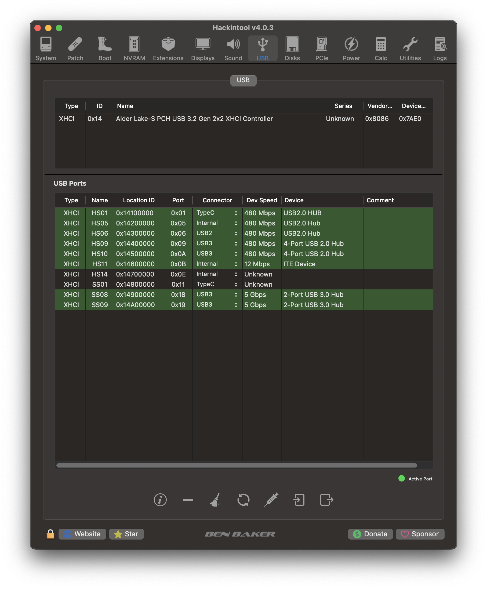

# Gigabyte Aorus Pro B660M Hackintosh

## System Overview

| Type | Item |
| ---- | ---- |
| Motherboard | B660M Gigabyte Aorus Pro DDR4 |
| CPU | Intel Core i7-12700F @ 2.10 GHz, 25M Cache, up to 4.90 GHz|
| RAM | 2 x DDR4 Adata XPG Spectrix D50 16GB 3200Mhz |
| GPU | Sapphire Nitro+ RX 6900 XT 8GB |
| SSD1 | Western Digital SN850 500GB NVMe Gen4x4 Solid State Drive |
| SSD2 | Samsung PM9A1 256GB NVMe Gen4x4 Solid State Drive |
| SSD2 | Lexar 256GB SATA Solid State Drive |
| SSD3 | KingSpec 480GB SATA Solid State Drive |
| Sound | Realtek ALC897 |
| Wireless, Bluetooth | Dell DW1560 |
| LAN | Intel Ethernet I-225V |
| BIOS Version | F28 **(Stable version for Intel Gen 12th)** |

## Current Status

| Feature | Status |
| ------------- | ------------- |
| CPU Power Management | ✅ Working |
| Sleep/Wake | ✅ Working |
| AMD RX 6900 XT Graphics Acceleration | ✅ Working |
| Wi-Fi/Bluetooth | ✅ Working |
| Ethernet | ✅ Working |
| Audio | ✅ Working |
| Speakers and Headphones | ✅ Working |
| iMessage/Facetime and App Store | ✅ Working  |
| Airdrop/Handoff | ✅ Working |
| FileVault 2 | ✅ Working |
| DRM | ✅ Working |
| BootCamp | ✅ Working |

## BIOS Configuration

Recommend you should `Load Optimized Default` first. Then save and restart and go to BIOS again.

### Tweaker:
* Extreme Memory Profile: **Profile 1**

### Settings:

* IO Ports:
  - Above 4G Decoding: **Enabled**
  - Above 4G MMIO BIOS assignment: **Disabled** (Will cause the problem with the 2nd sleep)
  - Re-size BAR Support: **Disabled** (Will cause the problem with the 2nd sleep)
  - Super IO Configuration → Serial Port: **Disabled** (Will cause the problem with Apple Watch unlock)

  - USB Configuration:
    - Port 60/64 Emulation → **Disabled**

  - Network Stack Configuration → Network Stack: **Disabled**

* Miscellaneous:
  - Intel Platform Trust Technology(PTT) → **Enabled**
  - Vt-d → **Disabled**

### Boot: 
  - CFG Lock: **Disabled**
  - Fast Boot: **Disable Link**
  - Windows 10 Features: **Windows 10**
  - CSM Support: **Disabled**
  - Secure Boot: **Disabled** (Secure Boot will be disabled by default, but good to check)

## USB Mapping
- USB Map is done by `SSDT-USBP.aml`. Can be used for AX motherboard with Intel wireless card.

## CPU Power Management
* CPU power management is handled with `CPUFriend` and `CPUFriendDataProvider` for SMBIOS `MacPro7,1`. If you have CPU Geekbench score is lower than me, please check your BIOS configuration. If BIOS is correct, the single score and multi score almost should be liked the result picture.

## 4K Monitor User
* According to Dortania, some displays may fail to wake randomly with AMD dGPU, mainly caused by AGDC preferences. I've already added the property in `DeviceProperties`. You may want to remove the `#` to enable it.

## Sapphire Nitro RX 6900XT User
* For Sapphire Nitro RX 6900XT user, you can enable `SSDT-ZeroRPM-OFF.aml` in config.plist to enable Zero RPM in macOS.
* More informations can be found at [here](https://github.com/perez987/6600XT-on-macOS-with-softPowerPlayTable).
Many thanks to perez987 for his amazing work.

## iService
* To use iMessage and other Apple services, you need to generate your own serial numbers. This can be done using [CorpNewt's GenSMBIOS](https://github.com/corpnewt/GenSMBIOS). Make sure model is `MacPro7,1`. Then, go [Apple Check Coverage page](https://checkcoverage.apple.com/) to check your generated serial numbers. If the website tells you that the serial number **is not valid**, that is fine. Otherwise, you have to generate a new set.

* Next you will have to copy the following values to your `config.plist`:
  - Serial Number -> `PlatformInfo/Generic/SystemSerialNumber`.
  - Board Number -> `PlatformInfo/Generic/MLB`.
  - SmUUID -> `/PlatformInfo/Generic/SystemUUID`.
  Reboot and Apple services should work.

* If they don't, follow [this in-depth guide](https://dortania.github.io/OpenCore-Post-Install/universal/iservices.html). It goes deeper into ROM, clearing NVRAM, clearing Keychain (missing this step might cause major issues), and much more.

## CPU Topology Rebuild
* Starting from version 2.0.2, CpuTopologyRebuild will be enabled by default without any boot-arg or NVRAM variable.
* CpuTopologyRebuild will make E-Cores to be recognized as the 3-way SMT logical threads of the P-Cores. That means with my i7-12700F, I will have 8 cores and 20 threads on macOS. This boot-arg can fix Xcode app building.
* More informations can be found at [here](https://github.com/b00t0x/CpuTopologyRebuild). Thanks to b00t0x for his amazing work.

## Credit
* Apple for macOS.
* Acidanthera Team for OpenCore Bootloader and many Kernel Extensions.

## Support
* Support me: 
  - [Paypal](https://www.paypal.me/tekun0lxrd)
